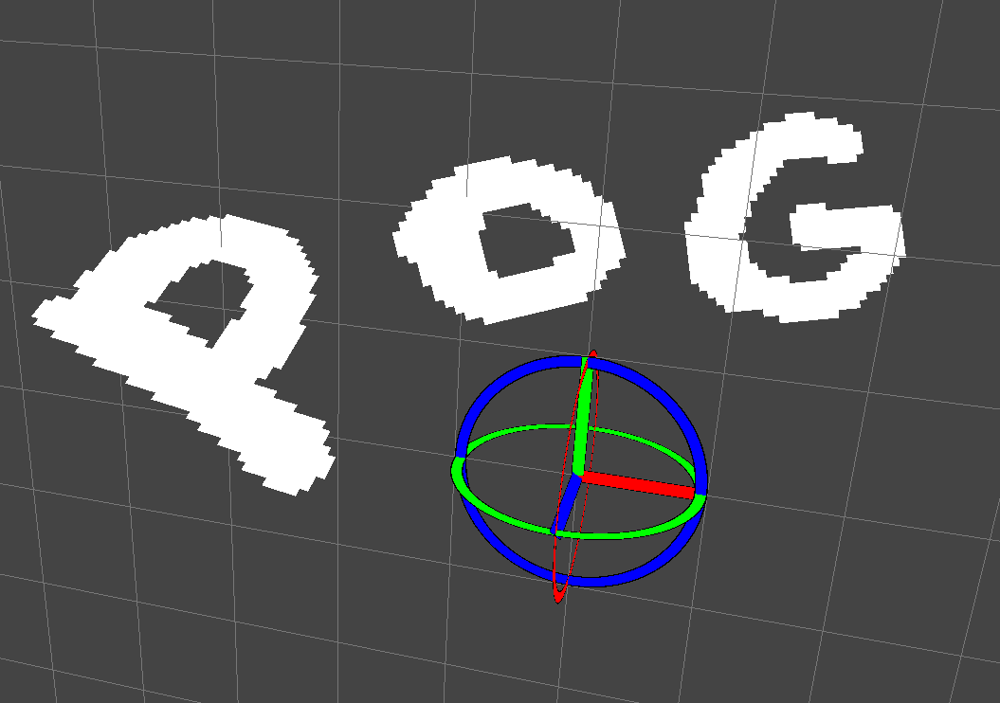

# PogPaint 3d

A paint that allows you to have 2d layers placed in 3d space.

## Try it out

This is a very early prototype but you can [try the demo here](https://kuviman.github.io/PogPaint).

See the [controls here](data/keys.toml).
